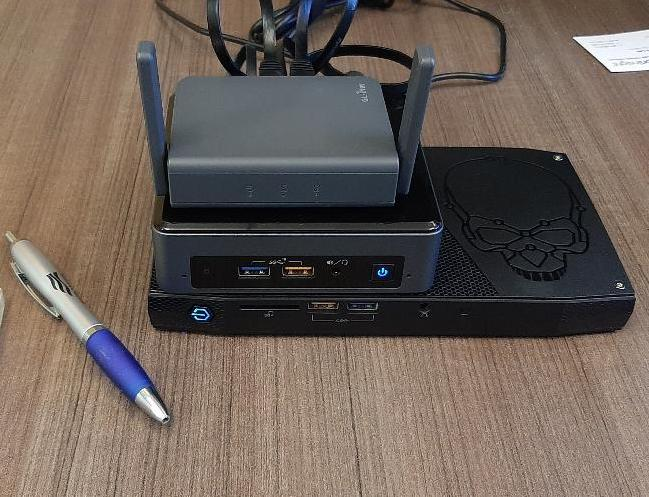

## Building an OpenShift - OKD 4.X Lab, Soup to Nuts

### Equipment for your lab

You will need at least one physical server for your lab.  More is obviously better, but also more expensive.  I have built my lab around the small form-factor NUC systems that Intel builds.  My favorite is the [NUC6i7KYK](https://ark.intel.com/content/www/us/en/ark/products/89187/intel-nuc-kit-nuc6i7kyk.html).  This little guy is about the size of a VHS video tape, remember those... ;-)

The NUC6i7KYK sports a quad-core 6th Generation i7 processor.  It has 2 M.2 slots for SSD storage and will accept up to 64GB of DDR4 RAM in its 2 SODIMM slots.  It is marketed toward gamers, but makes a very compact and powerful server for your lab.


I am also a fan of the [NUC8i3BEK](https://ark.intel.com/content/www/us/en/ark/products/126149/intel-nuc-kit-nuc8i3bek.html).  This one is even smaller than the NUC6i7KYK.  It sports a dual-core CPU, supports 32GB of RAM and has a single M.2 slot for an SSD.  I use one of these for my [Bastion Host](pages/Bastion.md) server.

I don't know if the NUC6i7KYK are still available.  They may have been discontinued now.  However, the newly released [NUC10i7FNK](https://www.intel.com/content/www/us/en/products/boards-kits/nuc/kits/nuc10i7fnk.html) is in the same price range and sports a 6-core processor at 25W TDP vs 45W TDP for the i6KYK.  It also supports 64GB of RAM.  I may begin selling off older units and replacing them with these.

You will need a network switch.  I am using a couple of [Netgear GS110EMX](https://www.netgear.com/support/product/GS110EMX.aspx).  It's a great little managed switch with 8 1Gb ports and 2 10Gb ports.  The 10Gb ports are really handy if you also have a NAS device that supports 10Gb network speeds.  

You will also need a router.  Assuming that you already have a home router, you can use that.  However, if you want something portable and awesome, check out the GL.iNet [GL-AR750S-Ext](https://www.gl-inet.com/products/gl-ar750s/).  This little guy runs OpenWRT which means that you can use it as a router for your lab network, plus - Wireless bridge, VPN, PXE, Http, DNS, etc...  [OpenWRT](https://openwrt.org) is a very powerful networking distro.  There is a new version out now, [GL-MV1000](https://www.gl-inet.com/products/gl-mv1000/).  It does not have WiFi, but it is much faster than the GL-AR750S-Ext.  I carry the AR750 with me when traveling, and use a pair of the MV1000s in my home lab.

Optional: NAS device.

in 2019, I came across this little Frankenstein.  The QNAP NAS-Book [TBS-453DX](https://www.qnap.com/en-us/product/tbs-453dx).  This thing is not much bigger than the NUCi7KYK, (the VHS tape).  It has 4 M.2 slots for SSD storage and will serve as an iSCSI server, in addition to all of the other capabilities that QNAP markets it for.  The iSCSI server is what caught my eye!  This thing completes a mini-datacenter setup.  With this device added to my lab, I am able to replicate most of the capabilities that you will find in an enterprise datacenter.

My home lab has grown to be almost embarrassing...  but, what can I say, except that I have a VERY understanding wife.


For your own lab, I would recommend starting with the following:

* 1 x NUC8i3BEK - For your Control Plane and development server
    * 32GB RAM
    * 500GB M.2 SATA SSD
* 1 x NUC6i7KYK - For your Hypervisor
    * 64GB RAM
    * 1TB M.2 SATA SSD
* 1 x GL.iNet GL-AR750S-Ext - For your router



A minimal setup like this will cost a little less than a 13" MacBook Pro with 16GB of RAM.  For that outlay you get 6 CPU cores (12 virtual CPUs), 96GB of RAM, and a really cool travel router!

Check prices at [Amazon.com](https://www.amazon.com) and [B&H Photo Video](https://www.bhphotovideo.com).  I get most of my gear from those two outlets.

Once you have acquired the necessary gear, it's time to start setting it all up.

# WIP:


```
yum -y install ipmitool

pip3.6 install virtualbmc

mkdir -p /data/tftpboot/ipxe/templates

uci set dhcp.@dnsmasq[0].enable_tftp=1
uci set dhcp.@dnsmasq[0].tftp_root=/mnt/sda1/tftpboot
uci set dhcp.@dnsmasq[0].dhcp_boot=boot.ipxe
uci add_list dhcp.lan.dhcp_option="6,10.11.11.10,8.8.8.8,8.8.4.4"
uci commit dhcp
/etc/init.d/dnsmasq restart

```

1. Set some environment variables for your lab. You will need to know the domain that you created during DNS setup, the IP address of your Name Server, your network mask, your network gateway, the hostname of your Nginx server, and if you set up PXE install, you will need the IP address of the HTTP server hosting your install repo.

    LAB_DOMAIN=your.domain.com                # The Domain you created during DNS setup
    LAB_NAMESERVER=10.10.11.10                # The IP address of your DNS Server
    LAB_NETMASK=255.255.255.0                 # The network mask of your lab network
    LAB_GATEWAY=10.10.11.1                    # Your router IP address
    INSTALL_HOST_IP=10.10.11.1                # The IP of the host serving the install repo (your PXE server or your control plane server)
    INSTALL_ROOT=/usr/share/nginx/html/install
    REPO_HOST=ocp-controller01                # Your Control Plane server
    REPO_PATH=/usr/share/nginx/html/repos     # The path to the repos served by Nginx on your control plane
    OKD4_LAB_PATH=~/okd4-lab
    DHCP_2=10.11.12.1

mkdir -p ~/bin/lab_bin

cat <<EOF > ~/bin/lab_bin/setLabEnv.sh
#!/bin/bash

export PATH=${PATH}:~/bin/lab_bin
export LAB_DOMAIN=${LAB_DOMAIN}
export LAB_NAMESERVER=${LAB_NAMESERVER}
export LAB_NETMASK=${LAB_NETMASK}
export LAB_GATEWAY=${LAB_GATEWAY}
export DHCP_2=${DHCP_2}
export REPO_HOST=${REPO_HOST}
export INSTALL_HOST_IP=${INSTALL_HOST_IP}
export INSTALL_ROOT=${INSTALL_ROOT}
export REPO_URL=http://${REPO_HOST}.${LAB_DOMAIN}
export INSTALL_URL=http://${INSTALL_HOST_IP}/install
export REPO_PATH=${REPO_PATH}
export OKD4_LAB_PATH=${OKD4_LAB_PATH}
export OKD_REGISTRY=registry.svc.ci.openshift.org/origin/release
export LOCAL_REGISTRY=nexus.oscluster.clgcom.org:5002/origin
export LOCAL_SECRET_JSON=${OKD4_LAB_PATH}/pull-secret.json
EOF


